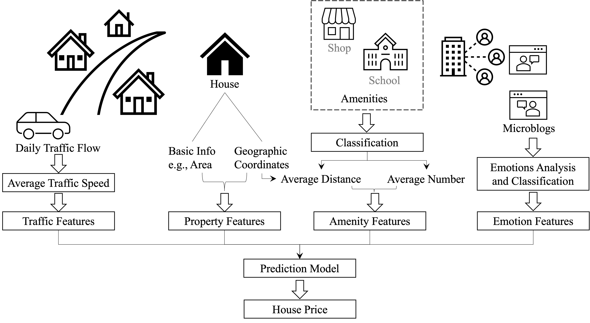
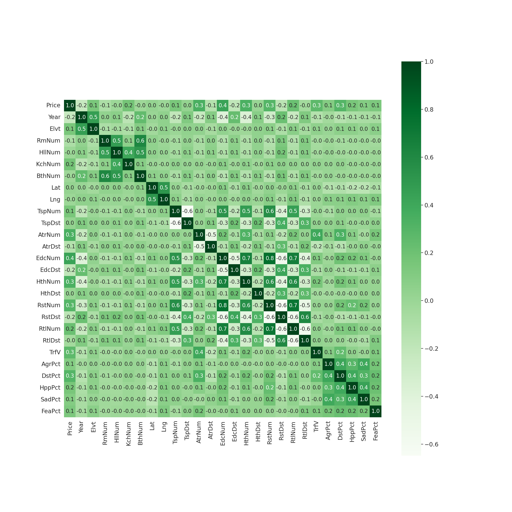

# PATE
In this repository we provide code of the paper:
> **PATE: Property, Amenities, Traffic and Emotions Coming Together for Real Estate Price Prediction**

> Yaping Zhao, Ramgopal Ravi, Shuhui Shi, Zhongrui Wang, Edmund Y. Lam, Jichang Zhao

> arxiv link: https://arxiv.org/abs/2209.05471

The **H4M Dataset** is released at: [https://indigopurple.github.io/H4M/index.html](https://indigopurple.github.io/H4M/index.html)

<p align="center">

</p>

<p align="center">

</p>

# Usage
0. For pre-requisites, run:
```
conda env create -f environment.yml
conda activate pate
```
1. To reproduce the results and figures in the paper, run:
```
python main.py
```
2. For further research, visit the website of [H4M Dataset](https://indigopurple.github.io/H4M/index.html).

# Related Work
| Title                          |                              Paper                              |                      Code                      |
|--------------------------------|:---------------------------------------------------------------:|:----------------------------------------------:|
| House Price Prediction: A Multi-Source Data Fusion Perspective                        | [Paper](https://ieeexplore.ieee.org/abstract/document/10654670) | [Code](https://github.com/IndigoPurple/house)  |
| A Large-Scale Spatio-Temporal Multimodal Fusion Framework for Traffic Prediction                          | [Paper](https://ieeexplore.ieee.org/abstract/document/10654669) |                       -                        |
| Large-Scale Traffic Congestion Prediction based on Multimodal Fusion and Representation Mapping                           |            [Paper](https://arxiv.org/abs/2208.11061)            | [Code](https://github.com/luckkyzhou/TCP-MFRM) |
| PATE: Property, Amenities, Traffic and Emotions Coming Together for Real Estate Price Prediction                      |            [Paper](http://arxiv.org/abs/2110.04966)             |  [Code](https://github.com/IndigoPurple/PATE)  |
| H4M: Heterogeneous, Multi-source, Multi-modal, Multi-view and Multi-distributional Dataset for Socioeconomic Analytics in Case of Beijing |                            [Paper](https://arxiv.org/abs/2208.12542)                            |                    [Code](https://github.com/IndigoPurple/H4M)                    |


# Citation
Cite our paper if you find it interesting!
```
@ARTICLE{zhao2024,
  author={Zhao, Yaping and Zhao, Jichang and Lam, Edmund Y.},
  journal={Big Data Mining and Analytics}, 
  title={House Price Prediction: A Multi-Source Data Fusion Perspective}, 
  year={2024},
keywords={price prediction;real estate;data mining;machine learning},
  doi={10.26599/BDMA.2024.9020019}}


@inproceedings{zhao2022h4m,
  title={{H4M}: Heterogeneous, Multi-source, Multi-modal, Multi-view and Multi-distributional Dataset for Socioeconomic Analytics in Case of Beijing},
  author={Zhao, Yaping and Shi, Shuhui and Ravi, Ramgopal  and Wang, Zhongrui and Lam, Edmund Y and Zhao, Jichang},
  booktitle={IEEE International Conference on Data Science and Advanced Analytics},
  year={2022},
  organization={IEEE}
}

@inproceedings{zhao2022pate,
  title={{PATE}: Property, Amenities, Traffic and Emotions Coming Together for Real Estate Price Prediction},
  author={Zhao, Yaping and Ravi, Ramgopal and Shi, Shuhui and Wang, Zhongrui and Lam, Edmund Y and Zhao, Jichang},
  booktitle={IEEE International Conference on Data Science and Advanced Analytics},
  year={2022},
  organization={IEEE}
}
```
